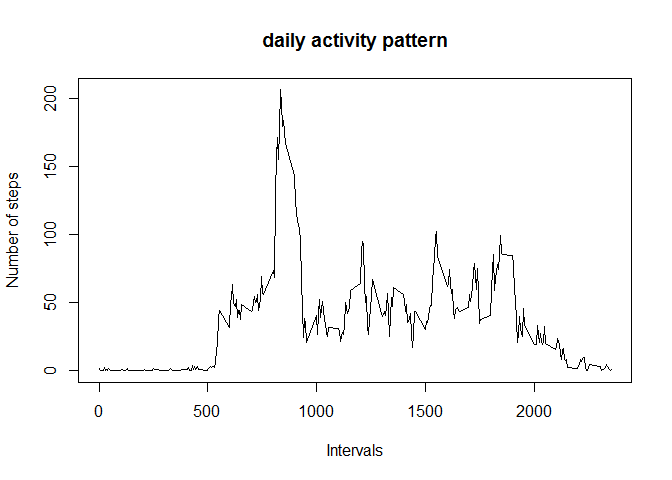

# Reproducible Research: Peer Assessment 1


## Loading and preprocessing the data

-Loading the data

-Making the columns factors

-Loading ggplot and plyr


```r
setwd("C:/Users/Aditya/Desktop/Data_Science/Workspace")
act <- read.csv(unz("./RepData_PeerAssessment1/activity.zip", "activity.csv"))
act<-transform(act,interval = as.factor(interval))
act<-transform(act,date = as.factor(date))
library(ggplot2)
library(plyr)
```

## What is mean total number of steps taken per day?

-Stepsum computes the sum of steps with date as the factor


```r
stepsum<-tapply(act$steps,act$date,sum,na.rm=TRUE)
hist(stepsum, breaks=30, xlab = "Step Count", main ="Step count by day")
```

 

```r
stepferq<- round(mean(stepsum),2)
stepmedian<- median(stepsum)
```

The **mean and median** of the total number of steps taken per day is **9354.23 and 10395**

## What is the average daily activity pattern?

-Omitted the NA values

-Transformed the dataframe to add a cloumn which contains the steps/interval avg.


```r
act1<-na.omit(act)
act1<-ddply(act1,'interval',transform, stepbyint= mean(steps))
with(act1, plot(as.numeric(as.character(interval)),stepbyint, type="l",xlab="Intervals",ylab="Number of steps",main="daily activity pattern"))
```

 

```r
maxint<-act1$interval[act1$stepbyint==max(act1$stepbyint)][1]
```
The interval with the maximum number of steps on an average is **835**

## Imputing missing values


```r
act2<-act
countna<-sum(as.numeric(is.na(act2$steps)))
act2$steps[is.na(act2$steps)==TRUE]<-mean(act1$steps)
stepsum2<-tapply(act2$steps,act2$date,sum)
stepferq2<- round(mean(stepsum2),2)
stepmedian2<-round(median(stepsum2),2)

hist(stepsum2, breaks=30, xlab = "Number of steps", main ="Step count by day")
```

 

There are **2304** number of missing values in the dataset. In this example we have replaced this value with the average steps/interval/day, i.e. 37.38. The new mean and median values are **1.076619\times 10^{4} and 1.076619\times 10^{4}.** The mean differs from the original dataset by **15.09%** and the median differs by  **3.57%**


## Are there differences in activity patterns between weekdays and weekends?


```r
act3<-act2
act3$Weekday<- "Weekday"
act3$Weekday[weekdays(strptime(act3$date, format ="%Y-%m-%d", tz="GMT"))=="Sunday"|weekdays(strptime(act3$date, format ="%Y-%m-%d", tz="GMT"))=="Saturday"]<-"Weekend"
act3$Weekday<-as.factor(act3$Weekday)
act3<-ddply(act3,.(interval,Weekday),transform, stepbyint= mean(steps))
qplot(as.numeric(as.character(interval)),stepbyint,data=act3,geom="line",facets=Weekday~.,xlab="Intervals",ylab="Number of steps")
```

 
